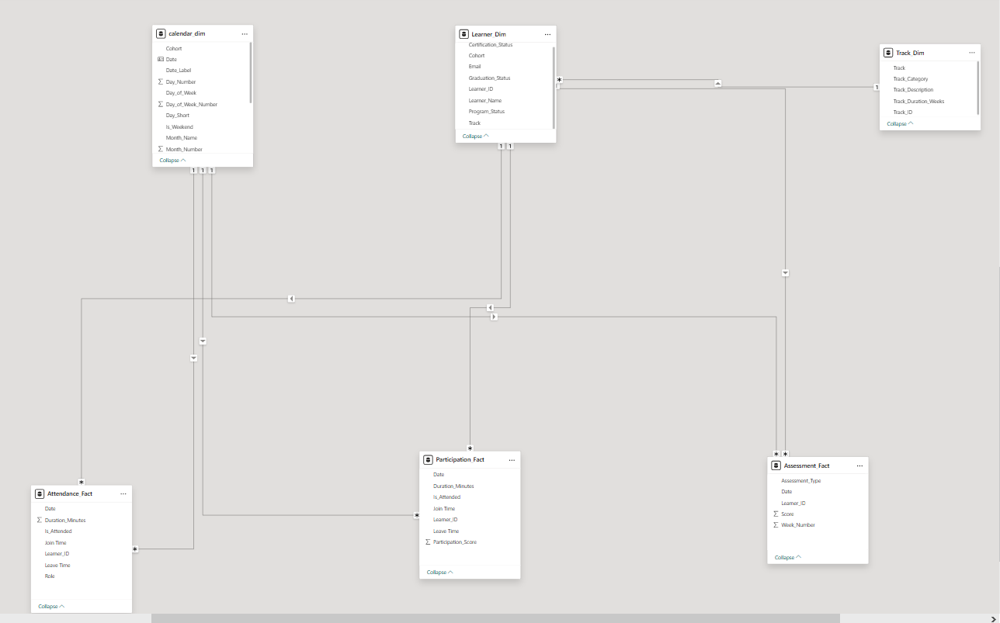

# Student Progress & Performance Dashboard — Dare Careers

## Table of Contents

- [Project Overview](#project-overview)
- [Business Context](#business-context)
- [Data Sources](#data-sources)
  - [Source Directory Structure](#source-directory-structure)
  - [Data Descriptions](#data-descriptions)
- [Data Preparation](#data-preparation)
  - [Import & Cleaning](#import--cleaning)
  - [Attendance Rule](#attendance-rule)
  - [Data Aggregation](#data-aggregation)
- [Data Modeling](#data-modeling)
  - [Star Schema Design](#star-schema-design)
  - [Table Definitions](#table-definitions)
  - [Relationships](#relationships)
- [DAX Measures](#dax-measures)
- [Dashboard Pages](#dashboard-pages)
  - [Page 1 — Overall Performance Metrics](#page-1--overall-performance-metrics)
  - [Page 2 — Detailed Learner Insights](#page-2--detailed-learner-insights)
- [Key Insights](#key-insights)
- [Tools & Technologies](#tools--technologies)
- [Author](#author)

---

## Project Overview

This project delivers a comprehensive **Power BI dashboard** for **Dare Careers**, a professional training organization offering programs in Power BI and AWS Cloud. The dashboard tracks and visualizes student progress and performance across a 10-week training cycle, enabling program managers and trainers to monitor learner engagement, identify at-risk students, and measure key outcomes such as certification and graduation rates.

---

## Business Context

Dare Careers enrolls learners into cohort-based training tracks (Power BI and AWS Cloud). Each cohort spans **10 weeks**, during which learners attend daily Zoom sessions, participate in class activities, and complete weekly labs and quizzes. At the end of the program, learners are assessed for:

- **Graduation** — successful completion of the program.
- **Certification** — achieving the required benchmark to receive a formal certificate.

Program stakeholders need visibility into:

1. How learners are performing across cohorts and tracks.
2. Which learners are at risk of dropping out.
3. Overall program health via aggregated KPIs.

---


### Data Descriptions

| Data Category | Content | Granularity | Key Fields |
|---|---|---|---|
| **Zoom Attendance** | Daily Zoom session logs recording join/leave times and duration | Per session, per learner, per day | Learner Name, Email, Join Time, Leave Time, Duration (Minutes) |
| **Lab and Quizzes** | Weekly assessment scores for labs and quizzes | Per week, per learner | Learner Name, Assessment Type (Lab/Quiz), Score, Week Number |
| **Participation Records** | Daily engagement and participation metrics | Per day, per learner | Learner Name, Date, Participation Score, Duration |
| **Status Records** | Final learner outcomes | Per learner | Learner Name, Graduation Status, Certification Status, Program Status |

---

## Data Preparation

### Import & Cleaning

All data files were imported into Power BI using **Power Query Editor**. The following transformations were applied:

1. **Folder-based import** — Each data category (attendance, participation, assessments, status) was loaded by connecting to the respective folder, allowing Power Query to automatically combine all files within each directory.

2. **Column standardization** — Column names were cleaned and standardized across all source files to ensure consistency (e.g., unifying `Learner_Name`, `Email`, `Learner_ID` fields).

3. Data type corrections — Fields were assigned appropriate data types:
   - `Date` → Date type
   - `Duration_Minutes` → Whole Number
   - `Score` → Decimal Number
   - `Join_Time` / `Leave_Time` → Time type

4. Null and duplicate handling — Rows with missing critical fields (e.g., Learner_ID, Date) were removed. Duplicate entries within the same session were deduplicated.

5. Derived columns — Calculated columns were created in Power Query:
   - is_Attended — Boolean flag based on the 30-minute attendance rule (see below).
   - Cohort — Extracted from the enrollment data or date ranges.
   - Track — Derived from the source folder path (Power BI vs. AWS Cloud).

### Attendance Rule

> **Condition:** A learner is marked as **"attended"** only if they spent **more than 30 minutes** in a Zoom session.

This rule is applied consistently across all attendance calculations in both dashboard pages. The `is_Attended` column in the `Attendance_Fact` table encodes this logic:

is_Attended = Duration_Minutes > 30


Sessions where a learner connected but stayed for 30 minutes or less are excluded from attendance rate calculations.

### Data Aggregation

- **Weekly lab and quiz scores** are aggregated to provide averages and totals at both the individual learner level and cohort level.
- **Daily attendance records** are rolled up to calculate per-learner and per-cohort attendance percentages.
- **Participation scores** are averaged across the 10-week period to produce a single engagement metric per learner.

---

## Data Modeling

### Star Schema Design

The data model follows a **star schema** architecture, with clearly separated **dimension tables** (descriptive attributes) and **fact tables** (transactional/measurable data). A dedicated **Measures table** holds all DAX calculations.



### Table Definitions

#### Dimension Tables

| Table | Purpose | Key Fields |
|---|---|---|
| **Learner_Dim** | Stores learner profile and outcome information | `Learner_ID` (PK), `Learner_Name`, `Email`, `Cohort`, `Track`, `Graduation_Status`, `Certification_Status`, `Program_Status` |
| **Calendar_Dim** | Date dimension enabling time-based filtering and analysis | `Date` (PK), `Cohort`, `Date_Label`, `Day_Number`, `Day_of_Week`, `Day_of_Week_Number`, `Day_Short`, `Is_Weekend`, `Month_Name`, `Month_Number` |
| **Track_Dim** | Describes the training tracks offered | `Track_ID` (PK), `Track`, `Track_Category`, `Track_Description`, `Track_Duration_Weeks` |

#### Fact Tables

| Table | Purpose | Key Fields |
|---|---|---|
| **Attendance_Fact** | Records daily Zoom session attendance per learner | `Date`, `Learner_ID` (FK), `Duration_Minutes`, `is_Attended`, `Join_Time`, `Leave_Time`, `Role` |
| **Participation_Fact** | Captures daily participation and engagement metrics | `Date`, `Learner_ID` (FK), `Duration_Minutes`, `is_Attended`, `Join_Time`, `Leave_Time`, `Participation_Score` |
| **Assessment_Fact** | Stores weekly lab and quiz scores | `Date`, `Learner_ID` (FK), `Assessment_Type`, `Score`, `Week_Number` |

#### Measures Table

| Measure | Description |
|---|---|
| `Average Assessment Score` | Mean score across all quizzes and labs |
| `Average Attendance %` | Percentage of sessions attended (using the 30-min rule) |
| `Average Lab Score` | Mean score for lab assessments only |
| `Average Participation Score` | Mean daily participation/engagement score |

### Relationships

All relationships follow a **one-to-many (1:*)** cardinality from dimension tables to fact tables, with a **single-direction cross-filter**:

| From (1) | To (*) | Join Key | 
|---|---|---|
| `Learner_Dim` | `Attendance_Fact` | `Learner_ID` |
| `Learner_Dim` | `Participation_Fact` | `Learner_ID` |
| `Learner_Dim` | `Assessment_Fact` | `Learner_ID` |
| `Calendar_Dim` | `Attendance_Fact` | `Date` |
| `Calendar_Dim` | `Participation_Fact` | `Date` |
| `Calendar_Dim` | `Assessment_Fact` | `Date` |
| `Track_Dim` | `Learner_Dim` | `Track` / `Track_ID` |

This ensures:
- **No ambiguous filter paths** — each fact table connects to each dimension through exactly one active relationship.
- **Clean filter propagation** — slicers on dimension tables (e.g., filtering by Track or Cohort) correctly filter all related fact tables.
- **No circular dependencies** — the model has a clear directional flow from dimensions to facts.

---
## DAX Measures

Key DAX formulas used in the dashboard:

```dax
// Total Learners
Total Learners = DISTINCTCOUNT(Learner_Dim[Learner_ID])

// Total Graduations
Total Graduations = 
CALCULATE(
    DISTINCTCOUNT(Learner_Dim[Learner_ID]),
    Learner_Dim[Graduation_Status] = "Graduated"
)

// Total Certifications
Total Certifications = 
CALCULATE(
    DISTINCTCOUNT(Learner_Dim[Learner_ID]),
    Learner_Dim[Certification_Status] = "Certified"
)

// Total Dropouts
Total Dropouts = 
CALCULATE(
    DISTINCTCOUNT(Learner_Dim[Learner_ID]),
    Learner_Dim[Program_Status] = "Dropout"
)

// Graduation Rate %
Graduation Rate % = 
DIVIDE([Total Graduations], [Total Learners], 0) * 100

// Certification Rate %
Certification Rate % = 
DIVIDE([Total Certifications], [Total Learners], 0) * 100

// Dropout Rate %
Dropout Rate % = 
DIVIDE([Total Dropouts], [Total Learners], 0) * 100

// Average Attendance % (applying 30-min rule)
Average Attendance % = 
AVERAGEX(
    VALUES(Learner_Dim[Learner_ID]),
    DIVIDE(
        CALCULATE(COUNTROWS(Attendance_Fact), Attendance_Fact[is_Attended] = TRUE()),
        CALCULATE(COUNTROWS(Attendance_Fact)),
        0
    )
) * 100

// Average Assessment Score
Average Assessment Score = AVERAGE(Assessment_Fact[Score])

// Average Participation Score
Average Participation Score = AVERAGE(Participation_Fact[Participation_Score])

// Total Labs Completed
Total Labs Completed = 
CALCULATE(
    COUNTROWS(Assessment_Fact),
    Assessment_Fact[Assessment_Type] = "Lab"
)

// Total Hours Spent in Class
Total Hours in Class = 
DIVIDE(SUM(Attendance_Fact[Duration_Minutes]), 60, 0)
```
## Dashboard Pages

### Page 1 — Overall Performance Metrics

**Objective:** Provide a high-level overview of learner performance, summarizing key metrics for program stakeholders.


#### Summary Cards

| Card | Value | Description |
|---|---|---|
| **Total Learners** | 140 | Total number of learners enrolled across all cohorts |
| **Total Certifications** | 92 | Learners who achieved certification |
| **Total Graduations** | 119 | Learners who successfully graduated |
| **Total Dropouts** | 21 | Learners who dropped out before completing the program |

#### Bar Charts

Six horizontal bar charts compare key metrics **by Track** (Power BI vs. AWS Cloud):

| Chart | Power BI | AWS Cloud | Insight |
|---|---|---|---|
| **Graduation Rate %** | 86% | 83% | Power BI track has a slightly higher graduation rate |
| **Dropout Rate %** | 14% | 18% | AWS Cloud track has a higher dropout rate |
| **Certification Rate %** | 68% | 60% | Power BI learners certify at a higher rate |
| **Average Attendance %** | 100% | 79% | Significant attendance gap between tracks |
| **Avg Participation Per Learner** | 88 | 48 | Power BI learners are nearly 2x more engaged |
| **Average Assessment Score** | 50 | 52 | AWS Cloud learners score marginally higher on assessments |

#### Slicers (Filters)

- **Track** — Filter by Power BI or AWS Cloud
- **Certification Status** — Filter by certification outcome
- **Program Status** — Filter by Ongoing, Completed, or Dropout
- **Cohort** — Filter by specific cohort

---

### Page 2 — Detailed Learner Insights

**Objective:** Provide detailed insights into individual learner progress and engagement for trainers and program managers.


#### Summary Cards

| Card | Value | Description |
|---|---|---|
| **Total Labs Completed** | 1,400 | Total number of labs completed across all learners |
| **Avg Labs Per Learner** | 10.00 | Average number of labs completed per learner |
| **Average Assessment Score** | 50.81 | Mean score across all quizzes and labs |
| **Avg Participation Rate** | 81.89 | Average engagement score based on daily participation |
| **Total Hours in Class** | 10,566 | Total hours learners spent attending class sessions |
| **Avg Attendance Rate** | 94.07% | Average attendance rate per learner (30-min rule applied) |

#### Learner Detail Table

A scrollable table displays every learner with the following columns:

| Column | Description |
|---|---|
| `Learner_Name` | Full name of the learner |
| `Email` | Learner's email address |
| `Cohort` | The cohort the learner belongs to (e.g., Q3 2024) |
| `Graduation_Status` | Graduated or Not Graduated |
| `Certification_Status` | Certified or Not Certified |
| `Program_Status` | Completed, Ongoing, or Dropout |
| `Track` | Power BI or AWS Cloud |
| `Learner Attendance %` | Individual attendance rate (with conditional formatting) |
| `Learner Assessment Avg` | Individual average assessment score (with conditional formatting) |

**Conditional formatting** is applied to `Attendance %` and `Assessment Avg` columns using color gradient bars (green = high, red = low) for quick visual identification of high and low performers.

#### Slicers (Filters)

- **Cohort** — Filter by individual cohort
- **Track** — Filter by Power BI or AWS Cloud
- **Program_Status** — Filter by completion status
- **Week_Number** — Filter by specific week within the 10-week program
- **Certification Status** — Filter by certification outcome
- **Month** — Filter by calendar month

---

## Key Insights

Based on the dashboard analysis, the following insights were derived:

### Program Health
- **140 total learners** are enrolled, with **119 (85%) graduating** and **92 (66%) achieving certification**.
- The **dropout rate is 15%** (21 learners), indicating room for improvement in learner retention.

### Track Comparison
- **Power BI track outperforms AWS Cloud** across most metrics:
  - Higher graduation rate (86% vs. 83%)
  - Higher certification rate (68% vs. 60%)
  - Lower dropout rate (14% vs. 18%)
  - Significantly higher attendance (100% vs. 79%)
  - Nearly double the participation engagement (88 vs. 48)
- **AWS Cloud learners score marginally higher** on assessments (52 vs. 50), suggesting the content may be better absorbed despite lower engagement — or that the assessments are easier.

### Attendance & Engagement
- Overall **average attendance is 94.07%**, which is strong.
- The **stark gap between Power BI (100%) and AWS Cloud (79%)** attendance warrants investigation — possible causes include scheduling conflicts, content difficulty, or instructor engagement differences.
- Participation follows the same pattern — AWS Cloud learners are far less engaged during sessions.

### Assessment Performance
- The **average assessment score of 50.81** across all learners is moderate, suggesting assessments may be challenging or that additional support is needed for lower-performing students.
- Despite lower engagement, AWS Cloud learners maintain competitive scores, indicating potential for improvement with better attendance.

### At-Risk Indicators
#### NOTE:This indicator was excluded from the analysis because low attendance or assessment scores do not necessarily indicate a student is at risk of dropping out.
- Learners with **low attendance AND low assessment scores** should be flagged for early intervention.
- The table on Page 2 enables trainers to identify specific learners who need support through the conditional formatting — red bars indicate underperformance.

---

## Tools & Technologies

| Tool | Purpose |
|---|---|
| **Microsoft Power BI Desktop** | Dashboard development, data modeling, DAX measures, and visualization |
| **Power Query (M Language)** | Data import, transformation, and cleaning |
| **DAX (Data Analysis Expressions)** | Calculated measures for KPIs and dynamic aggregations |
| **Star Schema Modeling** | Structured data model with dimension and fact tables |

---

## Author

**Noah Jamal Nabila**  
Dare Careers — Power BI Module Lab  
Project Date: Q1 2026
